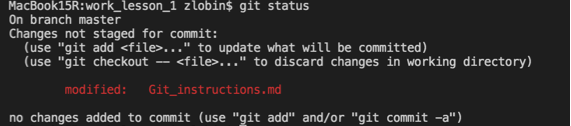
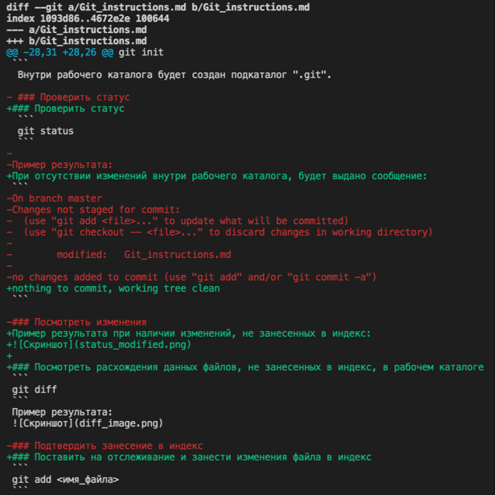
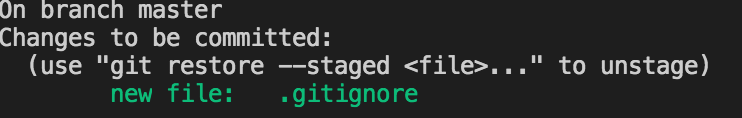
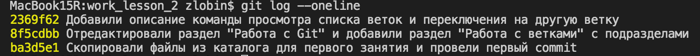
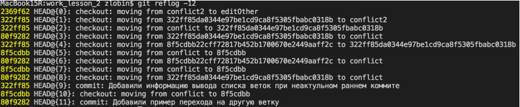
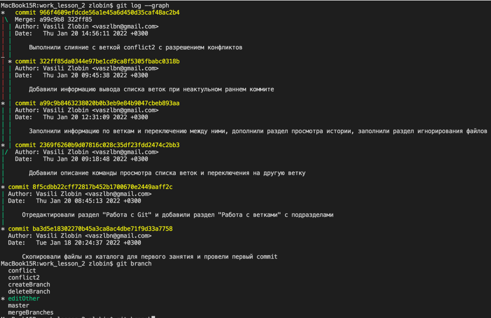
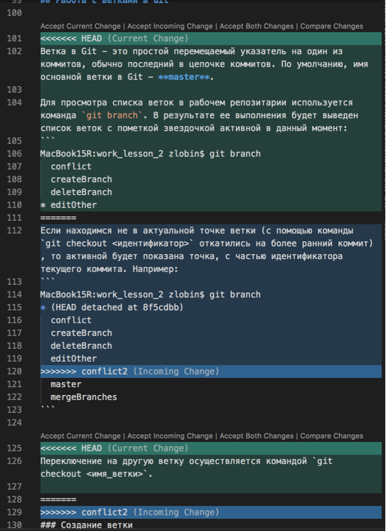

# Работа с Git

## Проверка наличия установленного Git

Выполнить в терминале следующую команду:
```
git --version
```
Если Git в наличии, то покажет версию Git, иначе будет сообщение об ошибке.

## Установка Git

[Установщик Git для OS X доступен для скачивания с сайта Git https://git-scm.com/download/mac](https://git-scm.com/download/mac)

## Настройка Git

При первом использовании Git необходимо представиться. Для этого выполните команды установки адреса электронной почты и имени пользователя:
```
git config --global user.email ваша_почта@example.com
git config --global user.name «Ваше имя англ буквами»
```
## Работа с Git

### Инициализировать Git в рабочем каталоге
Для этого перейдите в рабочий каталог и выполните команду:
```
git init
```
 Внутри рабочего каталога будет создан подкаталог ".git".

### Проверить статус
 ```
 git status
 ```
При отсутствии изменений внутри рабочего каталога, будет выдано сообщение:
```
nothing to commit, working tree clean
```

Пример результата при наличии изменений, не занесенных в индекс:


### Посмотреть расхождения данных файлов, не занесенных в индекс, в рабочем каталоге
```
git diff
```

Если все изменения занесены в индекс, то расхождения не будут отображаться.

Пример результата при наличии изменений, не занесенных в индекс:



*Примечание: прокрутка в многострочном режиме производится стрелками, для выхода из многострочного режима нажать Q*.

### Поставить на отслеживание новые файлы или занести изменения файла в индекс
```
git add <имя_файла>
```
Для занесения изменений отслеживаемых файлов в индекс можно использовать `git commit -a`. Для включения нового файла в отслеживаемые необходимо выполнять `git add <имя_файла>`.

После этого `git status` будет показывать занесение изменений в индекс:


### Выполнить commit изменений
```
git commit -m "Комментарий"
```
Команда выполняет подтверждение изменений, занесенных в индекс и поставленных на отслеживание, с указанным комментарием.

### Посмотреть историю подтвержденных изменений (коммитов)
```
git log
```
Команда отображает историю коммитов с их комментариями и уникальным идентификатором каждого. Идентификатор используется для отката состояния рабочего каталога на момент соответствующего коммита (смотри следующий раздел).

Для просмотра краткого отображения истории используйте с параметром _--oneline_ (`git log --oneline`) :


Для просмотра краткой истории переключения между коммитами используйте команду `git reflog`:


### Откатиться до коммита
```
git checkout <первые 4(и более) символа идентификатора коммита>
```
Состав рабочего каталога и содержимое входящих в него файлов изменяется на момент указанного коммита.

### Вернуться в актуальную точку ветки master
```
git checkout master
```
Для продолжения корректной работы с веткой git после отката на более ранние коммиты требуется вернуться на последнюю актуальную точку ветки.

### Игнорирование файлов

Для того, чтобы Git игнорировал некоторые файлы в рабочем каталоге, необходимо создать файл _.gitignore_, в который записать строки с именами файлов или шаблонами, которые соответствуют этим файлам или директориям(папкам, каталогам).

## Работа с ветками в Git

Ветка в Git - это простой перемещаемый указатель на один из коммитов, обычно последний в цепочке коммитов. По умолчанию, имя основной ветки в Git - **master**.

Для просмотра списка веток в рабочем репозитарии используется команда `git branch`. В результате ее выполнения будет выведен список веток с пометкой звездочкой активной в данный момент:
```
MacBook15R:work_lesson_2 zlobin$ git branch
  conflict
  createBranch
  deleteBranch
* editOther
```
Если находимся не в актуальной точке ветки (с помощью команды `git checkout <идентификатор>` откатились на более ранний коммит), то активной будет показана точка, с частью идентификатора текущего коммита. Например:
```
MacBook15R:work_lesson_2 zlobin$ git branch
* (HEAD detached at 8f5cdbb)
  conflict
  createBranch
  deleteBranch
  editOther
  master
  mergeBranches
```

Переключение на другую ветку осуществляется командой `git checkout <имя_ветки>`.

Пример перехода на другую ветку:
```
MacBook15R:work_lesson_2 zlobin$ git checkout conflict
Switched to branch 'conflict'
MacBook15R:work_lesson_2 zlobin$ git branch
* conflict
```

### Создание ветки

Для создания новой ветки без переключения на нее используйте команду
```
git branch <имя_новой ветки>
```
Для создания новой ветки с переключением на нее используйте одну из указанных команд:
```
git checkout -b <имя_новой ветки>
git switch -c <имя_новой ветки>
```

### Слияние веток

Для слияния активной ветки с другой выполните команду:
```
git merge <имя_другой_ветки>
```
Если никаких конфликтов при слиянии Git не обнаружит, то изменения сразу будут применены. Пример результата выполнения слияния без конфликтов:
```
MacBook15R:work_lesson_2 zlobin$ git merge createBranch
Updating 8f5cdbb..fd72397
Fast-forward
 Git_instructions.md | 10 ++++++++++
 1 file changed, 10 insertions(+)
 ```

Для просмотра графической истории ветвления со слиянием веток используйте команду `git log --graph`.



### Разрешение конфликтов при слиянии веток

Если при слиянии были обнаружены конфликты, которые Git не смог разрешить автоматически, он сообщит об этом. Пример такого результата:
```
MacBook15R:work_lesson_2 zlobin$ git merge conflict2
Auto-merging Git_instructions.md
CONFLICT (content): Merge conflict in Git_instructions.md
Automatic merge failed; fix conflicts and then commit the result.
```
В указанные файлы Git поместит управляющие строки-комментарии, для которых VSCode предлагает механизм их обработки.


После того, как разрешены все конфликты, Git позволит выполнить коммит.

### Удаление ветки

Для удаления ветки используйте команду `git branch -d <имя_ветки>`. Git не выполнит удаление, если активная ветка не была объединена с удаляемой, и выведет соответствующее сообщение:
```
MacBook15R:work_lesson_2 zlobin$ git branch -d conflict2
error: The branch 'conflict2' is not fully merged.
If you are sure you want to delete it, run 'git branch -D conflict2'.
```
Пример сообщения об успешном удалении ветки:
```
MacBook15R:work_lesson_2 zlobin$ git branch -d conflict2
Deleted branch conflict2 (was 322ff85).
```

## Работа с удаленными репозиториями

### Копирование репозитория (удаленного или локального)

Для копирования репозитория используйте команду:
```
git clone <путь к репозиторию для копирования>
```

В активной директории будет создана поддиректория с именем копируемого репозитория. Для продолжения работы с скопированным репозиторием требуется перейти в эту директорию (сделать ее активной).

### Настройка соединения локального репозитория и удаленного

Для этого требуется выполнить следующую команду:
```
git remote add <имя соединения> <путь к удаленному репозиторию>
```

Имя соединения в дальнейшем понадобится указывать в последующих командах.

Для проверки настроек соединения используте команду `git remote -v`. Пример результата:
```
MacBook15R:work_lesson_3 zlobin$ git remote -v
for_pull_request        https://github.com/VasiliZlobin/SCV_Git_2001.git (fetch)
for_pull_request        https://github.com/VasiliZlobin/SCV_Git_2001.git (push)
```

### Обмен данными между локальным и удаленным репозиториями

1. При создании нового репозитория на GitHub будет предоставлен список команд для настройки соединения с локальным и загрузки данных из него в удаленны репозиторий. Например:
```
git remote add origin https://github.com/VasiliZlobin/repo.git
git branch -M main
git push -u origin main
```

2. Для отправки данных на удаленный репозиторий используется команда `git push`. Git выдаст подсказку при необходимости использования ее параметров. Например, результат выполнения команды:
```
MacBook15R:repo zlobin$ git branch
* main
MacBook15R:repo zlobin$ git remote -v
origin	https://github.com/VasiliZlobin/repo.git (fetch)
origin	https://github.com/VasiliZlobin/repo.git (push)
MacBook15R:repo zlobin$ git push
Counting objects: 38, done.
Delta compression using up to 8 threads.
Compressing objects: 100% (34/34), done.
Writing objects: 100% (38/38), 3.57 KiB | 0 bytes/s, done.
Total 38 (delta 19), reused 0 (delta 0)
remote: Resolving deltas: 100% (19/19), done.
To https://github.com/VasiliZlobin/repo.git
 * [new branch]      main -> main
```

3. Для загрузки изменений из удаленного репозитория в локальный используется команда `git pull`. Git также выдаст подсказку при необходимости. Пример результата выполнения команды:
```
MacBook15R:repo zlobin$ git pull
remote: Enumerating objects: 5, done.
remote: Counting objects: 100% (5/5), done.
remote: Compressing objects: 100% (3/3), done.
remote: Total 3 (delta 2), reused 0 (delta 0), pack-reused 0
Unpacking objects: 100% (3/3), done.
From https://github.com/VasiliZlobin/repo
   4e4636a..7d78803  main       -> origin/main
Updating 4e4636a..7d78803
Fast-forward
 readme.md | 1 +
 1 file changed, 1 insertion(+)
```

### Создание pull request

1. Сначала необходимо сделать fork целевого репозитория для pull request.

2. Синхронизировать свою версию репозитория с локальным. Два способа:

   * Сделать `git clone` этого репозитория
   * В инициалированном репозитории выполнить команду `git pull <имя соединения> <имя ветки удаленного репозитория>`

3. Создать новую ветку в локальном репозитории, и в ней сделать все изменения с коммитами.

4. Отправить версию локального репозитория в свой удаленный репозиторий (`git push`). На странице удаленного репозитория создать pull request и отправить его.